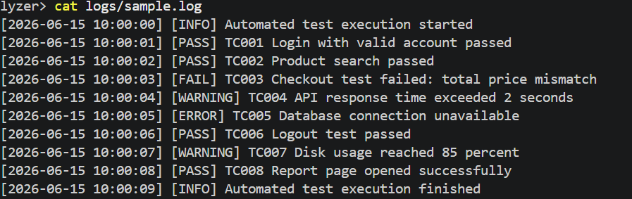
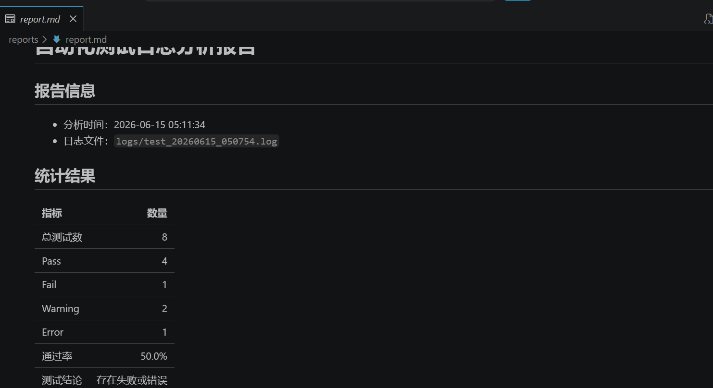

# Python + Shell 自动化测试与日志分析工具

项目使用 Shell 批量执行模拟测试任务并生成日志，再通过 Python 自动完成结果统计、异常日志提取和测试报告输出，实现以下测试流程：

**执行测试 → 生成日志 → 分析结果 → 输出报告 → 设计用例 → 记录缺陷 → 回归验证**

> Shell 中的测试任务为可重复执行的模拟任务，用于验证自动化执行和日志分析流程，不代表真实业务系统测试。

## 项目概览

| 项目 | 内容 |
|---|---|
| 主要技术 | Linux / WSL、Shell、Python 标准库、CSV、Markdown |
| 核心功能 | 批量执行测试、生成时间戳日志、统计结果、提取异常、输出报告 |
| 测试用例 | 17 条已执行功能测试用例 |
| 自动化测试 | 7 个核心逻辑与命令行测试 |
| 缺陷记录 | 3 条开发和验收过程中发现并修复的问题 |
| 运行环境 | Ubuntu / Linux / WSL；Python 模块兼容 Windows |

## 项目亮点

- 使用 Shell 批量执行 8 条模拟测试任务，覆盖 Pass、Fail、Warning、Error。
- 日志按时间戳生成，保留每次执行记录。
- Python 支持分析指定日志，也支持自动选择修改时间最新的日志。
- 自动统计测试数量、通过率和测试结论，并提取异常日志明细。
- 自动生成 CSV 和 Markdown 两种测试报告。
- 日志不存在时提供友好提示，输出目录不存在时自动创建。
- 使用 `unittest` 验证核心逻辑和命令行运行路径。
- 提供一键验收脚本，支持重复运行和自动验证。

## 运行效果

```text
日志分析完成
日志文件：logs/sample.log
总数：8 | Pass：4 | Fail：1 | Warning：2 | Error：1
异常日志：4 条
报告文件：reports/report.csv、reports/report.md
```

> 输出中的 Fail、Warning 和 Error 是预设的模拟测试结果，不代表脚本运行失败。

## 运行截图

### 示例日志

日志使用统一的时间、级别和测试任务格式。



### Markdown 报告

生成的报告包含测试数量、通过率、测试结论和异常日志明细。



## 快速运行

### 环境要求

- Python 3.9+
- Bash 4+
- 推荐使用 Ubuntu、Linux 或 WSL
- Windows 可直接运行 Python 日志分析模块
- 项目仅使用 Python 标准库，无需安装第三方依赖

### 一键运行完整流程

进入项目目录后，在 Ubuntu、Linux 或 WSL 中执行：

```bash
bash run_all.sh
```

该命令会依次执行模拟测试、生成并分析最新日志、输出报告，最后运行全部 Python 自动化测试。

### Windows 运行

```powershell
python analyze_log.py --log logs/sample.log
python -m unittest discover -s tests -v
```

### 单独运行各模块

```bash
# 执行模拟测试并生成时间戳日志
bash run_tests.sh

# 自动分析修改时间最新的日志
python3 analyze_log.py

# 分析指定日志
python3 analyze_log.py --log logs/sample.log

# 运行自动化测试
python3 -m unittest discover -s tests -v
```

## 项目结构

```text
auto-test-log-analyzer/
├── run_tests.sh                 # 执行模拟测试并生成日志
├── run_all.sh                   # 一键执行完整验收流程
├── analyze_log.py               # 日志分析和报告生成
├── tests/
│   ├── test_analyze_log.py      # 核心日志分析测试
│   └── test_cli.py              # 命令行集成测试
├── test_cases/
│   └── test_cases.md            # 测试用例与执行记录
├── logs/
│   └── sample.log               # 示例日志
├── reports/
│   ├── report.csv               # 示例 CSV 报告
│   └── report.md                # 示例 Markdown 报告
├── bugs/
│   ├── bug_report_template.md   # 缺陷记录模板
│   └── bug_samples.md           # 缺陷与修复记录
├── docs/
│   └── test_execution_report.md # 项目验收记录
├── screenshots/
│   └── *.png                    # 日志与报告截图
```

## 功能说明

### Shell 自动执行

`run_tests.sh` 会自动创建 `logs/` 目录，批量执行 8 条模拟测试任务，并生成类似 `logs/test_20260615_103000.log` 的时间戳日志。

### Python 日志分析

`analyze_log.py` 支持：

- 统计 Total、Pass、Fail、Warning、Error。
- 计算通过率并生成测试结论。
- 提取包含 Fail、Failed、Warning、Error 的异常日志行。
- 输出 `reports/report.csv` 和 `reports/report.md`。
- 通过 `--log` 指定日志，或默认分析修改时间最新的日志。

## 测试交付物

| 交付物 | 内容 |
|---|---|
| [测试用例](test_cases/test_cases.md) | 17 条正常、异常、边界和兼容性测试用例 |
| [验收记录](docs/test_execution_report.md) | 实际环境、运行命令、验证结果和已知限制 |
| [缺陷记录](bugs/bug_samples.md) | 3 条问题的复现步骤、根因、修复和回归证据 |
| [示例报告](reports/report.md) | 统计结果、通过率、结论和异常明细 |
| [示例日志](logs/sample.log) | 可直接用于运行日志分析 |

## 测试与验证

已完成以下验证：

- 17 条功能测试用例执行通过。
- 7 个 Python 自动化测试执行通过。
- Shell 脚本语法检查通过。
- Windows PowerShell 和 WSL 环境完成实际运行。
- 重复运行可以生成不同时间戳日志。
- 日志和报告目录不存在时可以自动创建。
- 日志不存在时返回友好错误和非零退出码。

自动化测试结果摘要：

```text
Ran 7 tests
OK
```

## 实现说明

- 测试结果使用 `[PASS]`、`[FAIL]`、`[WARNING]`、`[ERROR]` 统一标记，分析器根据日志级别统计，避免普通关键词重复计数。
- 默认日志通过文件修改时间选择，不依赖文件名排序。
- 项目内日志在报告中使用相对路径，避免包含本机绝对路径。
- CSV 使用 `utf-8-sig` 编码，便于在 Windows Excel 中直接打开。
- Shell 脚本使用严格模式，命令执行失败时停止流程。

## 项目边界

- Shell 中的任务是模拟测试任务，没有接入真实业务系统。
- 当前报告会在每次分析时覆盖，不保存历史趋势。
- 当前仅使用 Python 标准库，未使用 pytest、requests、Selenium 等第三方工具。
- 本项目不定位为生产环境测试平台。
